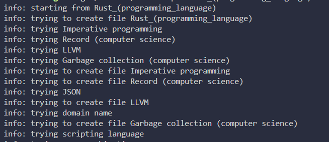

# WikiScrape

WikiScrape is a web scraper that crawls linked wikipedia resources from pages.

WikiScrape runs off a multithreaded tokio runtime with non blocking threads and execution.

</img>

## Features

- Multithreading
- Async execution
- 

## Structure
The main thread spawns tokio child tasks which check if the query requested resource already exists.
If the resource already exists, the thread returns early. If not, a web request is made and the linked resources are put into a file.

## Notes
- Occasionally, the main thread can appear to hang, this is because the spawned tasks are given a random wait time

## Todo
- [x] page GET
- [x] resource extraction from downloaded pages
- [ ] async execution
- [ ] multithreading
- [ ] unit testing
    - [x] string processing
    - [ ] multithreaded runtime