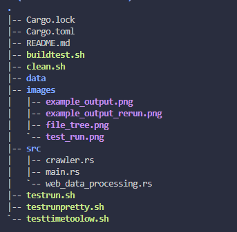

# WikiScrape

WikiScrape is a web scraper that crawls linked wikipedia resources from pages.

WikiScrape runs off a multithreaded tokio runtime with non blocking threads and execution.

</img>

## Fun things

- Multithreading
- Async execution
- Starts from a random wikipedia page when run without a starting page as an arg

## Structure
</img>

Code features are modularized by function. 
- web_processing.rs: all of web requests & processing
- crawler.rs: all code required to spawn a single crawler
- main.rs: all code required to spawn multiple crawlers, looping the output of others into the input of new crawlers

The main thread spawns tokio child tasks which check if the query requested resource already exists.
If the resource already exists, the thread returns early. If not, a web request is made and the linked resources are put into a file.

## Todo
- [x] page GET
- [x] resource extraction from downloaded pages
- [x] async execution
- [x] multithreading
- [x] unit testing
    - [x] string processing
    - [x] single thread evaluation
- [ ] integration testing
    - inherently non deterministic due to random thread wait times
